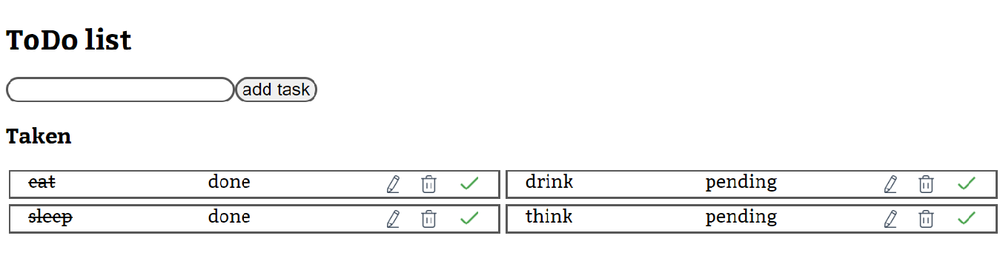

# simple ToDo-list

- Als gebruiker wil ik een inputveld zien waarin ik mijn taak in kan vullen.
- Als gebruiker kan ik op een button drukken met de tekst "Add Task" waardoor je ingevulde taak toegevoegd wordt aan de lijst.
- Als gebruiker zie ik wanneer ik op de add button knop heb geklikt, de taak verschijnen in mijn takenlijst.
- Taak verwijderen: Als gebruiker kan ik in de takenlijst op een icoontje klikken van een prullenbak, rechts naast de taak, waardoor de taak uit mijn takenlijst wordt verwijderd.

🚀  Extra requirements: 

- Taak doorstrepen: Als gebruiker kan ik in de takenlijst op een checkbox klikken, links naast de taak, waardoor de tekst van de taak doorgestreept wordt en ik mijn taak kan afstrepen.
- Als gebruiker wil ik op mijn taak kunnen klikken en de tekst kunnen aanpassen.

🚀  Extra API requirements (die samenhangt met het bovenstaande):

- PUT: update een bestaande taak de property done of niet done.
- PUT: update en bestaande taak met de PUT method.
